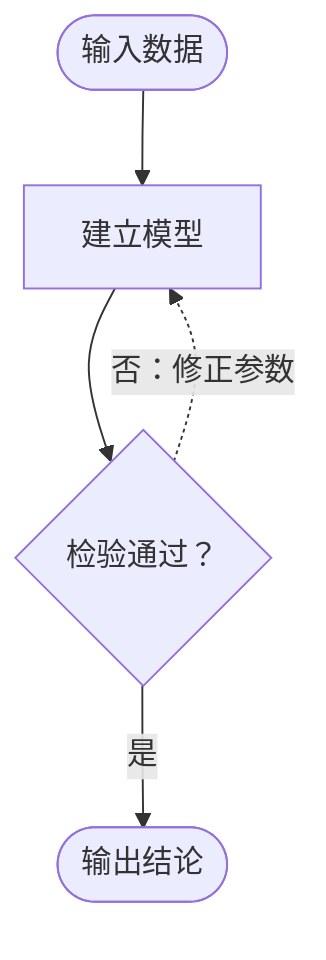

# Mermaid 草图指南

Mermaid 仅用于快速确认拓扑，不作为默认论文成图。确认节点与边后，转为 TikZ 精确排版。

不得用 Mermaid 绘制具体求解步骤或算法伪代码流程；这些内容使用正文编号或伪代码环境。

- 全部标签使用论文语言；中文论文不得保留英文模板词。
- 判断边必须写“是/否”或具体条件。
- 同一主链只保留一个阅读方向；反馈边沿外围返回。
- 禁止将 Mermaid 默认彩色主题截图直接嵌入论文。
- 论文成图不保留 Mermaid 的默认圆角卡片、粗箭头、画布标题或主题色。
- 最终 TikZ/PDF 的中文字体、字号、线宽和 600 DPI PNG 由本 skill 的渲染流程统一控制。
